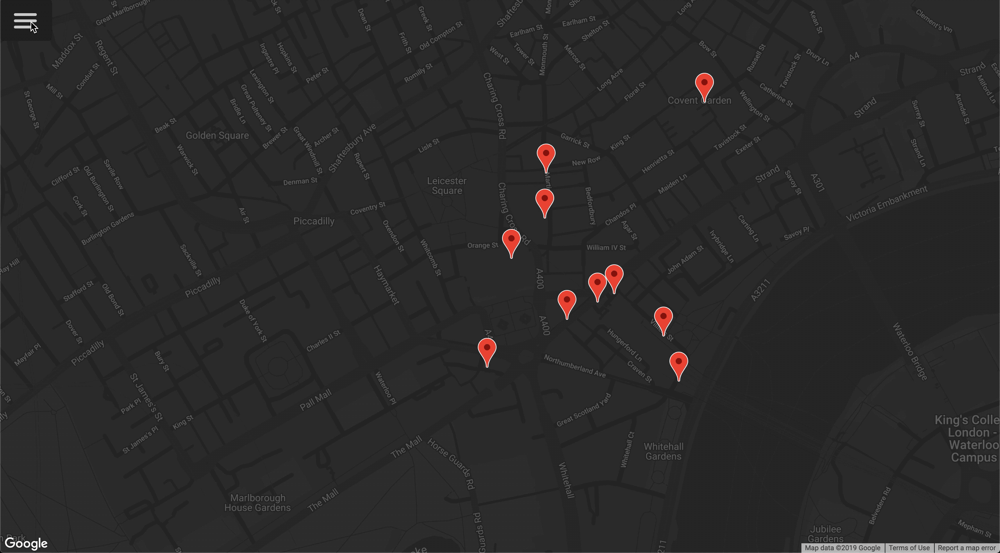
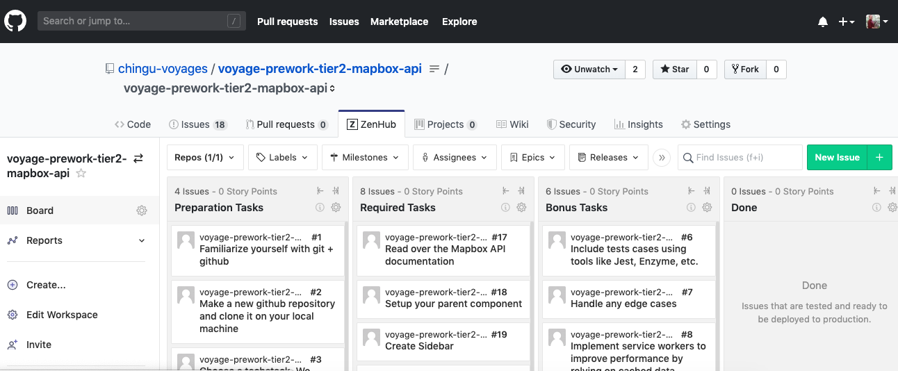

# Chingu Voyage Pre-work Project (Tier 2): Mapbox API

## Overview
This project helps you gain experience in using API's to enhance your applications.
Your objective with this project is to build a web application using the 
Mapbox API to build a map of a city of your choice.

## Instructions

General instructions for all Pre-Work Projects are located in the Chingu Voyage Handbook (URL posted in the
`#prework-community-news channel` on Discord). For detailed requirements checkout the ZenHub Board that is part of this repo.

To see the ZenHub tab on the GitHub repo webpage requires that you install ZenHub's browser extension. For more
information visit the [ZenHub Browser Extension page](https://www.zenhub.com/extension) and these 
[installation instructions](https://t.ly/3v8w).

If you would like to add these tasks to your repo so you can track the progress of your Solo Project and so they will be 
more readily available for reference you will need to manually add new issues to your ZenHub board and copy/paste the text
in our issues to yours.

Good Luck!!!

# MapBoxApi

This project was generated with [Angular CLI](https://github.com/angular/angular-cli) version 8.1.0.

## Development server

Run `ng serve` for a dev server. Navigate to `http://localhost:4200/`. The app will automatically reload if you change any of the source files.

## Code scaffolding

Run `ng generate component component-name` to generate a new component. You can also use `ng generate directive|pipe|service|class|guard|interface|enum|module`.

## Build

Run `ng build` to build the project. The build artifacts will be stored in the `dist/` directory. Use the `--prod` flag for a production build.

## Running unit tests

Run `ng test` to execute the unit tests via [Karma](https://karma-runner.github.io).

## Running end-to-end tests

Run `ng e2e` to execute the end-to-end tests via [Protractor](http://www.protractortest.org/).

## Further help

To get more help on the Angular CLI use `ng help` or go check out the [Angular CLI README](https://github.com/angular/angular-cli/blob/master/README.md).
